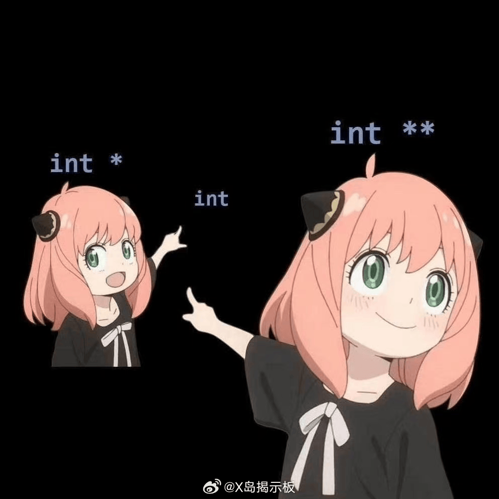

# C语言入门

*参考资料：《C Primer Plus（Stephen Prata）》、《C程序设计语言 (Brian W. Kernighan, Dennis M. Ritchie) 》、[翁恺C语言_](https://www.bilibili.com/video/BV1dr4y1n7vA?spm_id_from=333.788.videopod.episodes&vd_source=4fc959a02ef946a334065d8f36a22190&p=2)*、[尚硅谷C语言零基础入门教程（宋红康c语言程序设计精讲，含C语言考研真题）_哔哩哔哩_bilibili](https://www.bilibili.com/video/BV1Bh4y1q7Nt/?spm_id_from=333.337.search-card.all.click&vd_source=4fc959a02ef946a334065d8f36a22190)、[C 语言教程 | 菜鸟教程](https://www.runoob.com/cprogramming/c-tutorial.html)

**前置课程：C语言环境配置**

# 1.前言

## 了解计算机语言

### 解释什么是计算机语言

人类世界老板给员工下命令用的是人类听得懂的语言，如汉语英语，人给计算机下命令则是用的计算机认识的计算机语言。

计算机计算：CPU、寄存器、内存

### 计算机语言历史

**机器语言->**

```
0001100100010010
控制部分1        控制部分2       数据1      数据2
0001（算数运算）  1001（加法）    0001（1）  0010（2）
0010（逻辑运算）  1010（逻辑与）   0001（1）  0000（0） 

```

 

**汇编语言->**

```
ADD AX, BX 
```

  汇编语言：将AX和BX 中的数值相加，并且存在AX中

**高级语言：编译器、解释器->**

```
c=a+b;
```


## C语言能干什么、特点

**C语言特点：**

1.简洁高效

2.接近底层，贴近硬件，适合嵌入式开发

3.有高效的数据操控能力，如指针

4.可移植程度高

5.生成程序执行效率高

6.社区资源丰富，拥有成熟的编译器生态

 

**C语言能干什么：**

1.系统软件开发，如Windows，Linux

2.应用软件开发, Adobe系列软件

3.嵌入式开发, 智能家居、机器人

4.游戏开发

  


## C语言历史、C标准

  

### 1. K&R C (1978) - “经典C”

这是C语言的“非标准化”时期，由Brian Kernighan和Dennis Ritchie在《The C Programming Language》第一版中描述。它构成了C语言的基础，但缺乏现代标准的许多特性。

### 2. C89 / ANSI C 和 C90 / ISO C - **第一个官方标准**

这个版本**标准化**了C语言，消除了不同编译器之间的歧义和差异，是C语言普及的关键。

- **核心变化：**
  - **函数原型：** 引入了现代的函数声明方式，可以指定参数类型（`int func(int a, char b);`），增强了类型检查。
  - **`void` 和 `enum` 关键字：** 引入了`void`类型（用于表示无返回值函数和通用指针）和枚举类型（`enum`）。
  - **`const` 和 `volatile` 关键字：** 提供了定义常量和易失变量的能力，帮助编译器进行优化。
  - **标准库：** 定义了第一个标准库头文件（如 `<stdio.h>`, `<stdlib.h>`, `<string.h>` 等），统一了I/O、内存分配、字符串操作等函数。
  - **预处理器的增强：** 标准化了 `#elif`, `#error`, `#pragma` 等指令。

**C90和C89在技术上几乎没有区别，只是由不同组织（ANSI和ISO）发布。**

------

### 3. C99 - **重大现代化更新**

这个版本引入了许多使C语言更现代化、更强大、更易于使用的特性。

- **核心变化：**
  - **单行注释：** 引入了C++风格的 `//` 单行注释。
  - **变量声明不再限于块开头：** 可以在代码块的任何地方声明变量（类似于C++）。
  - **新的数据类型：**
    - `_Bool`: 布尔类型（需包含 `<stdbool.h>` 来使用 `bool`, `true`, `false`)。
    - `long long int` 和 `unsigned long long int`: 提供更宽的整数类型。
    - `_Complex` 和 `_Imaginary`: 支持复数和虚数运算（需包含 `<complex.h>`）。
  - **可变长度数组 (VLAs)：** 允许数组的长度在运行时决定。
  - **柔性数组成员 (Flexible Array Member)：** 允许结构体的最后一个成员是一个未指定大小的数组，用于动态内存分配。
  - **指定初始化器 (Designated Initializers)：** 允许通过指定下标或成员名来初始化数组和结构体的特定元素（如 `int a[10] = { [0] = 1, [9] = 2 };`）。
  - **复合字面量 (Compound Literals)：** 允许创建无名（匿名）的数组或结构体对象（如 `(int []){1, 2, 3}`）。
  - **`inline` 关键字：** 建议编译器将函数内联展开，以提升性能。
  - **`restrict` 指针：** 给编译器一个保证，表明该指针是访问其所指向数据的唯一方式，从而进行激进优化。

------

### 4. C11 - **专注于安全性和并发**

这个版本的重点是增加对多线程的支持和提高语言的安全性。

- **核心变化：**
  - **多线程支持：** 在标准库中引入了 `<threads.h>` 头文件，提供了线程创建/管理（`thrd_t`）、互斥锁（`mtx_t`）、条件变量（`cnd_t`）等支持。**这是C11最重要的特性之一。**
  - **泛型宏：** 引入了 `_Generic` 关键字，允许根据表达式的类型在编译时选择不同的代码段，实现了类似函数重载的功能。
  - **安全性增强函数：** 在 `<stdio.h>`, `<string.h>` 等库中引入了一系列带 `_s` 后缀的函数（如 `scanf_s`, `printf_s`, `strcpy_s`），旨在防止缓冲区溢出。但它们的接受度不如预期。
  - **匿名结构和联合：** 允许在结构体内定义无名嵌套的结构或联合，方便成员访问。
  - **快速退出：** 引入了 `_Exit()` 和 `quick_exit()` 函数，提供比 `exit()` 更快速的程序终止方式。
  - **`_Noreturn` 函数说明符：** 指明一个函数不会返回给调用者（如 `exit()` 函数）。

# 2.第一个C程序：hello world

- *如何进行“hello world”？*

## 逐行解释

**例程一：hello**

```c
#include <stdio.h> //""<>

int main() //main函数，程序的唯一入口
{
    printf("Hello, World!\n");
    return 0;
}
/*
    * 这是一个简单的C语言程序，输出"Hello, World!"到控制台。
    * 该程序使用了标准输入输出库stdio.h，并在main函数中调用printf函数来打印字符串。
    * 程序以return 0;结束，表示程序成功执行完毕。
*/
```

基础语法：

- **关键字（Keywords）**
- **标识符（Identifiers）**
- **常量（Constants）**
- **字符串字面量（String Literals）**
- **运算符（Operators）**
- **分隔符（Separators）**

## 编译（构建）

[C语言的编译过程详解 - 知乎](https://zhuanlan.zhihu.com/p/558783902)

 

 

### GCC 编译流程与常用命令速查表

| 阶段           | 命令示例                         | 核心选项                                     | 作用与说明                                                   |
| :------------- | :------------------------------- | :------------------------------------------- | :----------------------------------------------------------- |
| **编译全流程** | `gcc hello.c -o hello`           | `-o <输出文件名>`                            | **最常用命令**：一步完成预处理、编译、汇编、链接，直接生成可执行文件。 |
| **分步编译**   |                                  |                                              |                                                              |
| 1. **预处理**  | `gcc -E hello.c -o hello.i`      | `-E`                                         | 执行预处理，展开宏和头文件，生成 `.i` 文件。用于调试宏定义。 |
| 2. **编译**    | `gcc -S hello.i -o hello.s`      | `-S`                                         | 将预处理后的代码编译成汇编代码，生成 `.s` 文件。             |
| 3. **汇编**    | `gcc -c hello.s -o hello.o`      | `-c`                                         | 将汇编代码汇编成机器码，生成目标文件 `.o`（或 `.obj`）。     |
| 4. **链接**    | `gcc hello.o -o hello`           | (无)                                         | 将目标文件与库文件链接，生成最终的可执行文件。               |
| **常用选项**   |                                  |                                              |                                                              |
| **调试信息**   | `gcc -g main.c -o main`          | `-g`                                         | 在可执行文件中加入**调试信息**（如 GDB 使用），便于调试。    |
| **优化级别**   | `gcc -O2 main.c -o main`         | `-O0`（默认）, `-O1`, `-O2`, `-O3`           | 设置编译优化级别。`-O2` 常用在发布版本，在优化与编译时间间取得平衡。 |
| **警告选项**   | `gcc -Wall -Wextra main.c`       | `-Wall`, `-Wextra`, `-Werror`                | **强烈推荐使用**： `-Wall`：开启大多数常用警告。 `-Wextra`：提供更多警告。 `-Werror`：将所有警告视为错误。 |
| **包含头文件** | `gcc -I./include main.c`         | `-I<目录>`                                   | 指定额外的**头文件**搜索目录。                               |
| **链接库文件** | `gcc main.c -lm -L./lib -lmylib` | `-l<库名>`, `-L<目录>`                       | **链接库**： `-lmath` 链接 `libmath.a` 或 `libmath.so`。 `-L` 指定额外的**库文件**搜索目录。 |
| **定义宏**     | `gcc -DDEBUG main.c`             | `-D<宏名>` 或 `-D<宏名>=值`                  | 在命令行中定义预处理器宏，例如 `-DDEBUG` 等效于在代码中写 `#define DEBUG`。 |
| **标准版本**   | `gcc -std=c11 main.c`            | `-std=c89`, `-c99`, `-c11`, `-c17`, `-gnu99` | 指定遵循的 C 语言                                            |


***

预处理指令

头文件

C标准库

main函数

注释

# 3.变量、加减乘除，输入输出

- *怎么计算1+1？*

**例程二：格式化输出**

```c
#include <stdio.h>
int main() 
{
    printf("1+1=%d", 1+1);//decimal
    return 0;
}
```

- *有没有更好的方式计算1+1？*

**例程三：加法计算器**

```c
#include <stdio.h>
int main() 
{
    printf("please enter two numbers:\n");
    int a;
    int b;
    scanf("%d %d", &a, &b);
    printf("The sum of %d and %d is %d\n", a, b, a + b);
    return 0;
}

```


***

变量：数据类型 变量名;  （范围、变量名规则、占用内存大小、格式化输入/输出）

运算符初步

printf、scanf

关键字

表达式

语句

数据类型：int


# 4.更多数据类型，更多运算符，常量

- *小数如何表示？*

**例程四：计算圆的面积**

```c
#include <stdio.h>
#define PI 3.14159
// const PI=3.14159
int main() 
{
    float radius, area;
    printf("Enter the radius of the circle:\n");
    scanf("%f", &radius);
    area = PI * radius * radius;
    printf("Area of the circle: %.2f\n", area);
    return 0;
}

```

- *字符如何表示？*

**例程五：grades**

```c
#include <stdio.h>
int main()
{
    char letter;
    printf("Enter the letter:\n");
    scanf("%c",&letter);
    printf("The letter is %c\n",letter);
    char pattern[10] = "circle";
  //char *pattern = "circle";
    printf("%s\n",pattern);
    return 0;
}
```


- *整数乘浮点数会怎么样？*
- *变量与常量的区别？*

***


类型转换

常量

数据类型：float、char


# 5.数组，字符串


- *如何定义数组和使用数组*

**例程六：存储五位同学的成绩并根据需求调用**

```c
#include <stdio.h>
int main()
{
    //注：若定义时不赋值，则必须输入数组大小
    int grade[]={88,89,73,99,91};
    // int grade[5];
    // grade[0]=88;
    // grade[1]=89;
    // grade[2]=73;
    // grade[3]=99;
    // grade[4]=91;
    int n;
    printf("Enter the number of student:");
    scanf("%d",&n);
    printf("The grade of student %d is:%d",n,grade[n-1]);
    return 0;
}

```

- *如何输入字符串？*

**例程七：greet**

```c
#include <stdio.h>
int main() 
{
    printf("What's your name?\n");
    char name[50];
    scanf("%49s", name); // Read a string input safely
    printf("Hello, %s!\n", name);
}
```

- *如何处理字符串？*

**例程八：字符串的长度，拼接，比较**

```c
#include <stdio.h>
#include <string.h>
int main()
{
    char str1[] = "hello";
    char str2[] = "world";
    printf("%d  %d\n",strlen(str1),strlen(str2));

    char result[50];
    strcpy(result,str1);	//将str1复制粘贴到result
    strcat(result,",  ");	//拼接后面的变量到result后
    strcat(result,str2);	//strcat会自动处理\0
    printf("%s\n",result);
    printf("\0%s\n",result);//认识\0的作用

    char str3[] = "apple";
    char str4[] = "banana";
    
    int end = strcmp(str3,str4);	//根据ascii码一个一个比较
    if(end > 0)						//若str3大于str4则返回正数
    {
        printf("%s more than %s\n",str3,str4);
    }
    else if(end < 0)				//若str3小于str4则返回负数
    {
        printf("%s less than %s\n",str3,str4);
    }
    else							//若完全相同则返回0
    {
        printf("%s equal to %s\n",str3,str4);
    }
    return 0;
}
```


数组

字符串输入与输出

字符串基本操作

strcpy

strcat

# 6.函数、分支、调试

- *每次计算面积都要写一遍式子吗？*
- 能不能一个程序既计算圆的面积又计算正方形面积？

**例程九：计算圆的面积和正方形面积**

```c
#include <stdio.h>
int main() 
{
    int flag;
    printf("Enter 1 for circle area, 2 for square area:\n");
    scanf("%d", &flag);
    if (flag == 1)
    {
        float radius, area;
        printf("Enter the radius of the circle:\n");
        scanf("%f", &radius);
        area = 3.14159 * radius * radius;
        printf("Area of the circle: %.2f\n", area);
    }
    else if (flag == 2)
    {
        float side, area;
        printf("Enter the side length of the square:\n");
        scanf("%f", &side);
        area = side * side;
        printf("Area of the square: %.2f\n", area);
    }
    else
    {
        printf("Invalid option.\n");
    }
    return 0;
}
```

- *普通函数能传递参数，main能不能？*

**例程十：更好用的加法计算器**

注：此例程需要在终端运行时同时传入两个整数参数

如：.\test.exe  10  20

```c
#include <stdio.h>
#include <stdlib.h>
int main(int argc, char *argv[])
{
    if(argc != 3) {
        printf("Usage: %s <num1> <num2>\n", argv[0]);
        return 1;
    }
    int num1 = atoi(argv[1]);
    int num2 = atoi(argv[2]);
    printf("The sum of %d and %d is %d\n", num1, num2, num1 + num2);
    return 0;
} 
```


函数

分支

ASCII

终端运行

# 7.循环

- *如果有好多个图形的面积需要计算，有没有更友好的写法？*

**例程十一：循环计算多个面积**

```c
#include <stdio.h>
int main() 
{
    float radius[10], area[10];
    for(int i = 0; i < 10; i++) 
    {
        printf("Enter the radius of circle %d:\n", i + 1);
        scanf("%f", &radius[i]);
        area[i] = 3.14159 * radius[i] * radius[i];
    }
    for(int i = 0; i < 10; i++) {
        printf("Area of circle %d: %.2f\n", i + 1, area[i]);
    }
    return 0;
}

```

- *如果一开始并不知道我要计算几个面积怎么办？*

**例程十二：自定义计算面积数**

```c
#include <stdio.h>
#include <stdlib.h>
#define PI 3.14159
float SquareMeasure(int radius)
{
    return PI*radius*radius;
}
int main(int count,char *argv[])
{
    if(count != 2)
    {
        printf("Usage:%s <num>",argv[0]);
        return 1;
    }
    int num = atoi(argv[1]);
    int radius[num];
    for(int i=num;i>0;i--)	//注意此时i在循环中的变化
    {						//根据i以及使用需求决定下列循环中使用i时
        printf("Enter the radius of circle %d:  ",6-i);
        scanf("%d",&radius[5-i]);
    }
    for(int i=0;i<num;i++)
    {
        printf("Area of the circle %d: %.2f\n",i+1,SquareMeasure(radius[i]));
    }
    return 0;
}
```


数组

循环

函数传参与返回值

动态申请内存

代码规范

# 8.字符串

- *如何输入字符串？*

**例程十三：greet**

```c
#include <stdio.h>
int main() 
{
    printf("What's your name?\n");
    char name[50];
    scanf("%49s", name); // Read a string input safely
    printf("Hello, %s!\n", name);
}
```

- *如何处理字符串？*

**例程十四：字符串的长度，拼接，比较**

```c
#include <stdio.h>
#include <string.h>
int main()
{
    char str1[] = "hello";
    char str2[10] = "world";
    printf("%d  %d\n",strlen(str1),strlen(str2));

    char result[50];
    strcpy(result,str1);	//将str1复制粘贴到result
    strcat(result,",  ");	//拼接后面的变量到result后
    strcat(result,str2);	//strcat会自动处理\0
    printf("%s\n",result);
    printf("\0%s\n",result);//认识\0的作用

    char str3[] = "apple";
    char str4[] = "banana";
    
    int end = strcmp(str3,str4);	//根据ascii码一个一个比较
    if(end > 0)						//若str3大于str4则返回正数
    {
        printf("%s more than %s\n",str3,str4);
    }
    else if(end < 0)				//若str3小于str4则返回负数
    {
        printf("%s less than %s\n",str3,str4);
    }
    else							//若完全相同则返回0
    {
        printf("%s equal to %s\n",str3,str4);
    }
    return 0;
}
```


字符串输入与输出

字符串基本操作

strcpy

strcat

# 9.结构体

- *怎么将不同类型数据集成到一个变量中

**例程十五：储存学生信息并打印**

```c
#include <stdio.h>
typedef struct
{
    char Name[50];
    int Age;
    char Level;
    float Grade;
}StudentInformation;
/*  定义了一个名为StudentInformation的变量类型
    被这个类型定义的变量有四个元素，
    Name[50],Age,Level,Grade
    其中Name[50]和Level是字符变量，
    Age是整型变量，Grade是浮点型变量     */
int main()
{
    StudentInformation str[5];
    //定义了StudentInformation类型的数组
    printf("Enter the information(Name  Age  Level  Grade):\n");
    for(int i=0;i<5;i++)
    {
        //调用结构体变量的规则：
        scanf("%s %d %c %f",
            &str[i].Name,   
            &str[i].Age,
            &str[i].Level,
            &str[i].Grade);//提高代码可读性
    }

    for(int i=0;i<5;i++)
    {
        printf("The information of student %d is:\n",i+1);
        printf("Name:%s    Age:%d    Level:%c    Grade:%.2f\n",
                str[i].Name,
                str[i].Age,
                str[i].Level,
                str[i].Grade);
    }

    return 0;
}
```


结构体

结构体定义

代码规范与可读性

# 10.数据类型深入
各个数据类型的数据是如何存在内存中的?
### 整型(int(4), short(2), long(4), char(1))
- **有符号整型**：使用补码表示
- **无符号整型**：直接使用二进制原码
```c
int a = 10;        // 原码：0x 00(1) 00(2) 00(3) 0A(4)
short b = -5;      // 补码：0x FF(1) FB(2)
unsigned char c = 255; // 0x FF(1)
```
uint8_t  // 1字节
uint16_t // 2字节
uint32_t // 4字节

### 浮点型（float, double）
- 遵循 **IEEE 754标准**
- **float（32位）**：1位符号位 + 8位指数位 + 23位尾数位
- **double（64位）**：1位符号位 + 11位指数位 + 52位尾数位

### 数组
- 连续内存
- 元素类型与大小相同,按顺序排列

```c
int arr[3] = {1, 2, 3};
// 内存布局：4+4+4=12字节
```

### 结构体（struct）
- 成员顺序存储
- 可能存在内存填充以对齐
```C
struct Student {
    short a;     // 偏移量:0        2字节(填充至4字节)   
    int b;       // 偏移量:0+4=4    4字节               
    char c[5];  //  偏移量:4+4=8    5字节(填充至8字节)    
    float d;    //  偏移量:8+8=16   4字节(填充至8字节)    
    double e;   //  偏移量:16+8=24  8字节                
    char f;     // 偏移量:24+8=32   1字节(填充至8字节)    
}; // 总大小为32+8=40字节
```

### 对齐
基本类型的最大对齐通常是8字节\
char        // 1字节对齐\
short       // 2字节对齐\
int         // 4字节对齐\
float       // 4字节对齐\
double      // 8字节对齐\
long long   // 8字节对齐\
void*       // 8字节对齐

分析：最大对齐数为8\
short a: 2字节，偏移0，占用0-1字节。\
int b: 4字节，偏移量必须是4的整数倍，占用4-7字节。\
char c[5]: 5字节，每个元素对齐数为1，占用8-12字节。\
float d: 4字节，对齐数为4，下一个偏移量是13，但是13不是4的整数倍，需要填充3字节（13-15），占用16-19字节。\
double e: 8字节，对齐数为8，需要填充4字节（20-23），然后e从偏移24开始，占用24-31字节。\
char f: 1字节,结构体的总大小必须是最大对齐数的整数倍,填充至8字节

- 修改对齐方式
```c
#pragma pack(1)  // 1字节对齐
struct PackedStruct {
    char a;
    int b;
    short c;
}; // 总大小：1 + 4 + 2 = 7字节
#pragma pack()   // 恢复默认对齐
```

### 字节顺序（Endianness）

- 大端序（Big-endian）
```c
int num = 0x12345678;
// 内存布局：0x1000:12 0x1001:34 0x1002:56 0x1003:78
```

- 小端序（Little-endian）
```c
int num = 0x12345678;
// 内存布局：0x1000:78 0x1001:56 0x1002:34 0x1003:12
```
\
0b(Binary),0O(Octal),0x(Hexadecimal)
# 11.地址与指针
## 内存与地址
- 计算机内存由无数个存储单元组成，每个单元都有唯一对应的"门牌号" - 这就是内存地址
- 通过地址可以找到这个变量对应的内存空间

```c
int main() {
    int a = 10;
    printf("变量a的值: %d\n", a);
    printf("变量a的地址: %p\n", &a);  //%p输出pointer(指针) &是取地址运算符
    
    return 0;
}
```
## 指针的基本概念
### 什么是指针？
指针是用来存放内存地址的变量。\
当指针中存放着某变量的地址,我们就说这是指向某变量的指针

### 指针变量的运算
|&	|返回变量的地址。	|&a| 将给出变量的实际地址。|
|  ----  | ----  |  ----  | ----  |
|*	|指向一个变量。	    |*a/*p| 将指向一个变量/访问指针所指向变量的值   |
|+/-	|加/减	    |p+n/p-n|指向向后/向前移动n个元素的位置|
|++/--	|自增/自减	    |p++/p--| 将指向下/上一个元素的存储单元(跳跃长度与指针类型有关)|
|==/!=	|判断是否相等/是否不相等	    |p1==p2/p1!=p2|返回指针是否相等的判断结果|
|<, >, <=, >=	|判断地址大小	    |p1>=p2/p1<=p2|判断一个指针是否在另一个指针之前或之后|
|NULL |空指针|指针声明后并不会自动赋值,可以手动赋值NULL

### 指针变量的声明
指针的类型必须与它所指向的变量类型一致
```c
int    *ip;    /* 一个整型的指针 */
double *dp;    /* 一个 double 型的指针 */
float  *fp;    /* 一个浮点型的指针 */
char   *ch;    /* 一个字符型的指针 */
```

### 指针的赋值运算
```c
int main ()
{
   int  a = 20;   /* 变量*/
   int  *ip;        /* 指针变量的声明 */
 
   ip = &a;  /* 将ip赋值为变量a的地址/将ip指针指向a变量 */

   printf("a 变量的值: %d\n", a );
   printf("a 变量的地址: %p\n", &a  );
 
   /* 在指针变量中存储的地址 */
   printf("ip 变量的内容: %p\n", ip );
   /* 访问指针指向的变量的值 */
   printf("*ip 变量的值: %d\n", *ip );
 
   return 0;
}
```
```C
    int* p1;//?
    int *p2, p3;//?
```
### 数组与指针
```c
int main() {
    int arr[5] = {1, 2, 3, 4, 5};
    
    // 不同的指针声明方式
    int *p1 = arr;           // 指向数组首元素的指针
    // 可以看出来,实际上数组名本身单独拿出来就是指向数组首元素的指针
    int *p2 = &arr[0];       // 同上，更明确的写法
    int (*p3)[5] = &arr;     // 指向整个数组的指针
    
    printf("p1: %p, 指向的值: %d\n", p1, *p1);
    printf("p2: %p, 指向的值: %d\n", p2, *p2);
    printf("p3: %p, 指向的数组首元素: %d\n", p3, **p3);

    //因为数组中的元素在内存中是连续的,所以指针自增可以连续历遍所有数组元素
    printf("arr : ");
    for(int i = 0; i < 5; i++)
    {
        printf("%d,", *(p1++));
    }
    
    // 指针运算
    printf("\np3 + 1: %p\n", p3 + 1);  // 跳过整个数组(实际是跳过一行)
    
    return 0;
}
```

#### 二维数组指针
对于二维数组int arr[3][4]：\
arr是数组名，表示整个二维数组，它的类型是int [3][4]。\
arr本身的值是二维数组首元素的地址，即&arr[0][0]。\
arr[i]（i从0到2）表示第i行，是一个一维数组，类型为int [4]。\
arr[i]本身的值是第i行首元素的地址，即&arr[i][0]。\
arr[i][j]表示第i行第j列的元素。
```c
int main() {
    int arr[3][4] = {
        {1, 2, 3, 4},
        {5, 6, 7, 8},
        {9, 10, 11, 12}
    };
    int (*p)[4] = arr; //指向数组第一行的指针
    //arr的类型是int [3][4]，但是arr在表达式中会退化为指向第一行的指针，所以可以赋值给p。

    for (int i = 0; i < 3; i++)
    {
        for (int j = 0; j < 4; j++)
        {
            printf("%d ", *(*(p + i) + j)); //等效printf("%d ", p[i][j]);
        }
        printf("\n");
    }

    //(p + i) -- 指向第i行的指针
    //*(p + i) -- arr[i]
    //(*(p + i) + j) -- 因为arr[i]又是数组第i行首元素的地址(指针),所以相当于指向arr[i][j]的指针
    //*(*(p + i) + j) -- arr[i][j]的值

    return 0;
}
```
```C
    int *p1 = matrix;  // 指向第一个元素
    int (*p2)[4] = matrix;  // 指向第一行
    int (*p3)[3][4] = &matrix; // 指向整个二维数组
```
```C
()//结合优先级
int *p[4];
//[] 的优先级高于 *
//所以这是：int *(p[4])
//p是一个数组，包含4个int*指针,int [int*, int*, int*, int*]

int (*p)[4];
//所以这是：(*p) 是一个指针，然后指向 [4]
//p是一个指针，指向一个包含4个int的数组,int* -> [int, int, int, int]
```

### 结构体指针
一般我们使用.访问结构体成员
而对于结构体指针,我们使用->访问结构体成员,这经常在函数传参时用到
```C
// 定义结构体类型
struct Book 
{
    char title[50];
    float price;
};

void print_book(struct Book *book) // 使用结构体指针作为参数,避免复制整个结构体, 有利于优化性能
{
    printf("书名: %s\n", book->title);// 使用->访问结构体成员
    printf("价格: %.2f\n", book->price);
}

int main() {
    struct Book my_book = {"RM技巧", 25.0};
    
    print_book(&my_book);
    
    return 0;
}
```

### 多级指针
```C
int main() {
    int value = 100;
    int *ptr1 = &value;     // 一级指针
    int **ptr2 = &ptr1;     // 二级指针
    int ***ptr3 = &ptr2;    // 三级指针
    
    printf("value: %d\n", value);
    printf("*ptr1: %d\n", *ptr1);
    printf("**ptr2: %d\n", **ptr2);
    printf("***ptr3: %d\n", ***ptr3);
    
    // 通过多级指针修改变量值
    **ptr2 = 200;
    printf("修改后 value: %d\n", value);
    
    return 0;
}
```
 
```C
//结合优先级
int (*p1)[4] 
//指向一个包含4个int的数组int* -> [int, int, int, int]
//类型：指向int数组的指针

int *(*p2)[4]
//指向一个包含4个int指针的数组int* -> [int*, int*, int*, int*]
//类型：指向int指针数组的指针

int (**p3)[4]
//指向一个"指向包含4个int的数组"的指针
//类型：指向"指向int数组的指针"的指针（二级指针）int* -> int* -> [int, int, int, int]


#### 指针的算术运算
```c
#include <stdio.h>

int main() {
    int arr[5] = {10, 20, 30, 40, 50};
    int *ptr = arr;
    
    printf("数组元素: ");
    for(int i = 0; i < 5; i++) {
        printf("%d ", arr[i]);
    }

    printf("初始: ptr指向arr[0], 值=%d, 地址=%p\n", *ptr, ptr);
    
    ptr = ptr + 1;  // 移动到下一个int元素
    printf("ptr + 1: 指向arr[1], 值=%d, 地址=%p\n", *ptr, ptr);
    
    ptr = ptr + 2;  // 向后移动2个int元素
    printf("ptr + 2: 指向arr[3], 值=%d, 地址=%p\n", *ptr, ptr);
    
    ptr = ptr - 1;  // 向前移动1个int元素
    printf("ptr - 1: 指向arr[2], 值=%d, 地址=%p\n", *ptr, ptr);
    
    return 0;
}
```
#### 指针的比较运算

```c
int main() {
    int arr[5] = {10, 20, 30, 40, 50};
    int *p1 = &arr[1];  // 指向第二个元素
    int *p2 = &arr[3];  // 指向第四个元素
    int *p3 = &arr[1];  // 同样指向第二个元素

    printf("p1 = %p, p2 = %p, p3 = %p\n", p1, p2, p3);

    // 比较运算
    printf("p1 == p3: %d\n", p1 == p3);  // 1 (true)
    printf("p1 != p2: %d\n", p1 != p2);  // 1 (true)
    printf("p1 < p2:  %d\n", p1 < p2);   // 1 (true)
    printf("p1 > p2:  %d\n", p1 > p2);   // 0 (false)
    
    return 0;
}
```

# 12.指针传参
### 传值 vs 传地址
```c
void useVariable(int copy) 
{
    printf("副本的地址: %p\n", &copy);
    copy = 200;  // 修改的实际上是原参数的副本
}

void usePointer(int *copy) 
{
    printf("传入原变量的地址: %p\n", copy);
    *copy = 200;  // 修改的就是原参数
}

int main() 
{
    int original = 50;

    printf("原变量的地址: %p\n", &original);

    useVariable(original);
    
    printf("传值函数修改后原变量: %d\n", original);  // 仍然是50

    usePointer(&original);

    printf("传值函数修改后原变量: %d\n", original);  // 200
    
    return 0;
}
```
除了传指针,我们也可以
#### 如果在同一文件中,声明全局变量,在函数中可以直接使用并修改
```C
int global_var = 50; // 定义并初始化全局变量

void modify_global(void) 
{
    global_var = 200; // 修改全局变量
}

int main() 
{
    printf("修改前全局变量: %d\n", global_var);  // 50
    modify_global();
    printf("修改后全局变量: %d\n", global_var);  // 200
    return 0;
}
```
#### 如果在不同文件中,用extern关键字定义变量为外部变量,来实现在函数中改变变量的值
```C
//在文件A.h中
extern int global_var; // 声明外部变量
//在文件A.c中
#include <A.h>
int global_var = 50; // 定义并初始化外部变量

//在文件B.c中
#include <A.h> // 添加对应头文件引用
void modify_global(void) 
{
    global_var = 200; // 修改外部变量
}
```

# 13.函数指针
函数指针是指向函数的指针变量。它存储了函数的地址\
可以通过它来调用函数
### 函数指针的声明和使用
```C
int add(int a, int b) {
    return a + b;
}

int subtract(int a, int b) {
    return a - b;
}

int main() {
    int (*func_ptr)(int, int);  // 声明函数指针
    //函数返回类型 (*指针变量名)(函数参数列表);

    //和数组类似,函数名本身就是指向函数的指针
    func_ptr = add;             // 指向add函数,也可写为func_ptr = &add; 
    printf("Add: %d\n", func_ptr(10, 5));  // 输出15

    func_ptr = subtract;        // 指向subtract函数
    printf("Subtract: %d\n", func_ptr(10, 5));  // 输出5

    return 0;
}
```
### 回调函数
#### 函数指针作为某个函数的参数
```C
int add(int a, int b) {
    return a + b;
}

int subtract(int a, int b) {
    return a - b;
}

// 声明一个参数包含函数指针的函数
void calculate(int (*function)(int, int), int a, int b) 
{
    printf("Result: %d\n", function(a, b));
}
/* 也可以使用typedef简化函数指针类型定义
typedef int (*MathOperation)(int, int);
void calculate(MathOperation op, int a, int b) {
    printf("结果: %d\n", op(a, b));
}
*/

int main() {
    calculate(add, 10, 5);       // 输出15
    calculate(subtract, 10, 5);  // 输出5

    return 0;
}
```

```C
#include <stdlib.h>
void __cdecl qsort(void *_Base,size_t _NumOfElements,size_t _SizeOfElements,int (__cdecl *_PtFuncCompare)(const void *,const void *));

/**
 * __cdecl是调用约定，表示C语言默认的函数调用约定
 * @brief 使用快速排序算法对数组进行排序
 * @param _Base [in] 指向要排序数组的首元素的指针
 * @param _NumOfElements [in] 数组中的元素数量
 * @param _SizeOfElements [in] 数组中每个元素的大小（字节数）
 * @param _PtFuncCompare [in] 指向比较函数的指针，用于确定排序顺序
 * 
 * @return 无
 */
void __cdecl qsort(
    void *_Base,                                 // [in] 要排序的数组
    size_t _NumOfElements,                       // [in] 元素个数  
    size_t _SizeOfElements,                      // [in] 每个元素的大小
    int (__cdecl *_PtFuncCompare)(const void *, const void *)  // [in] 比较回调函数
);

/**
 * @brief qsort使用的比较函数
 * 
 * @param a [in] 指向要比较的第一个元素的指针
 * @param b [in] 指向要比较的第二个元素的指针  
 * 
 * @return 
 *   <0 如果a应排在b前面
 *    0 如果a和b相等
 *   >0 如果a应排在b后面
 */
int compare(const void *a, const void *b) {
    // 根据实际数据类型进行转换和比较
    const 实际数据类型 *ptrA = (const 实际数据类型*)a;
    const 实际数据类型 *ptrB = (const 实际数据类型*)b;
    
    // 实现比较逻辑

    return /* 比较结果 */;
}
```
```C
#include <stdio.h>
#include <stdlib.h>

// 比较函数：整型升序排序
int compare_int_asc(const void *a, const void *b) {
    return (*(int*)a - *(int*)b); //(int*)是将void指针转换为int指针,实际是*a - *b
    //因为传入的是void指针,但我们知道它实际指向的是int类型
    //return (*(int*)b - *(int*)a); //降序
}

int main() {
    int arr[] = {5, 2, 8, 1, 9, 3};
    int count = sizeof(arr) / sizeof(arr[0]);  // 计算数组元素个数
    
    // 升序排序
    qsort(arr, count, sizeof(int), compare_int_asc); // 通过传入不同的比较函数灵活实现多种类型不同排序方式
    
    printf("升序排序结果: ");
    for(int i = 0; i < count; i++) {
        printf("%d ", arr[i]);
    }
    
    return 0;
}
```